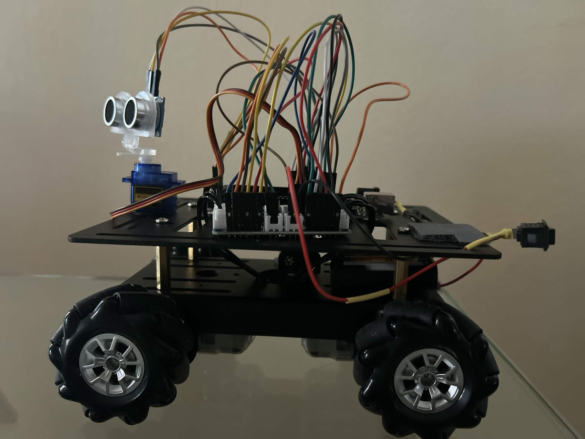
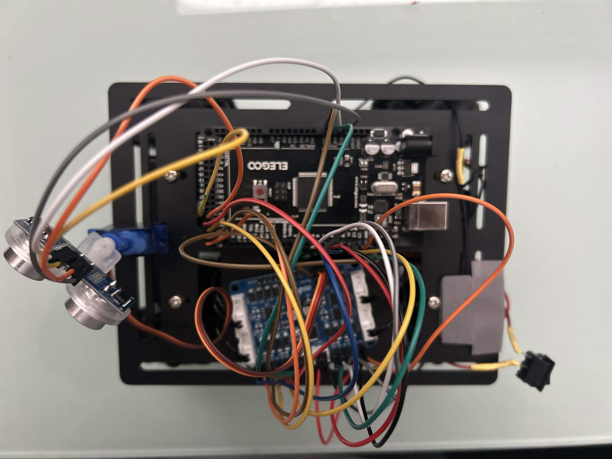
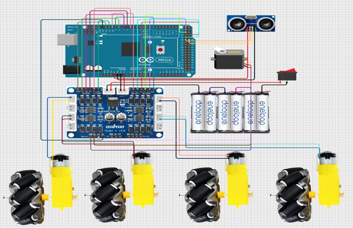
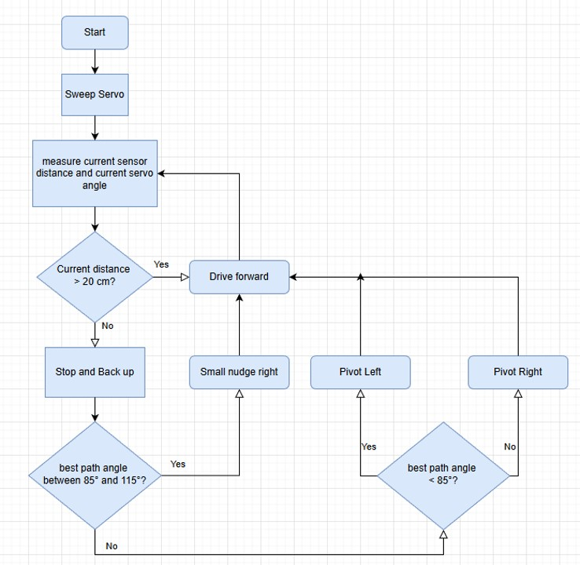

# Autonomous Obstacle-Avoiding RC Vehicle

## Project Overview
This project implements an autonomous RC vehicle capable of obstacle detection and avoidance using Arduino-based control systems. The vehicle continuously scans its environment with an ultrasonic sensor mounted on a servo, processes distance measurements to identify obstacles, and autonomously navigates around them while maintaining the ability to receive manual remote control commands.

## Detailed Components List

### Microcontroller & Processing
- **Arduino Mega 2560** (1 unit) - Main microcontroller board handling all sensor input and motor control logic

### Motor System
- **DC Gear Motors** (4 units) - 
  - Front Right (BK1)
  - Rear Right (AK1) 
  - Front Left (BK3)
  - Rear Left (AK3)
- **Motor Driver Circuit** (1 unit) - L298N or equivalent H-bridge driver controlling motor direction and speed
- **Motor Control Connections**:
  - Speed Control (PWM): Pins 9, 10, 11, 12 (AK1, AK3, BK1, BK3)
  - Direction Control: Pins 5, 6, 22, 24, 26, 28, 7, 8 (IN1-IN4 for all motors)

### Sensing System
- **Ultrasonic Distance Sensor** (1 unit) - HC-SR04 or compatible sensor for obstacle detection
  - Trigger Pin: 30
  - Echo Pin: 31
  - Maximum Detection Range: 200cm
  - Obstacle Stop Distance: 20cm
- **Servo Motor** (1 unit) - SG90 or equivalent for ultrasonic sensor positioning
  - Control Pin: 13
  - Sweep Range: 10° to 170°
  - Center Position: 100°
  - Sweep Step: 9° per iteration

### Libraries Used
- **NewPing.h** - For ultrasonic sensor distance measurement
- **Servo.h** - For servo motor control

### Power System
- **Battery Pack** (appropriate voltage for motors and electronics)
- **Power Distribution Board** - For supplying regulated power to Arduino and motor driver
- **Wiring & Connectors** - For all interconnections

### Chassis & Mechanical
- **Custom Chassis Frame** - Structural base for mounting all components
- **Motor Mounts** - Secure attachment points for DC motors
- **Sensor Mount** - Servo-mounted bracket for ultrasonic sensor
- **Wheels & Tires** - Compatible with DC gear motors

## Vehicle Iterations

### Version 1 (rc_1)

*First iteration of the autonomous RC vehicle with initial component layout*

### Version 2 (rc_2)

*Second iteration with improved component placement and wiring optimization*

## System Schematic

*Electrical schematic showing exact component connections, pin assignments, and wiring diagram*

## Obstacle Avoidance Algorithm

*Flowchart illustrating the continuous scanning, decision-making, and avoidance maneuver process*

## Test Demonstration
<video width="320" height="240" controls>
  <source src="https://raw.githubusercontent.com/dennysnguyen/x/main/vid_test/vid_test.mov" type="video/quicktime">
  Your browser does not support the video tag.
</video>
*Video demonstration showing the vehicle detecting obstacles at 20cm distance and executing avoidance maneuvers*

## How It Works - Detailed Operation

### Initialization Phase
1. **GPIO Setup**: All motor control pins (direction and PWM) configured as outputs
2. **Servo Initialization**: Ultrasonic servo attached to pin 13 and centered at 100°
3. **Variable Initialization**: 
   - Best clearance tracking variables reset
   - Sweep direction set to right (+1)
   - Current angle initialized to center position (100°)

### Main Loop Operation (Continuous)
1. **Servo Sweeping**:
   - Servo angle increments/decrements by 9° each cycle
   - Direction reverses at limits (10° minimum, 170° maximum)
   - At each direction reversal (when hitting 10°), best path variables reset

2. **Distance Measurement**:
   - At each servo position, ultrasonic sensor measures distance
   - Zero readings treated as maximum distance (200cm)
   - Best path continuously updated when clearer path found

3. **Obstacle Detection**:
   - Continuous monitoring of center-forward distance
   - When distance ≤ 20cm AND > 0cm, obstacle detected
   - Immediate transition to avoidance routine

4. **Avoidance Maneuver**:
   - **Backup Phase**: Vehicle moves backward at 70 PWM for 300ms to create maneuvering space
   - **Path Evaluation**: 
     - Clearance ≤ 20cm: Full pivot turn (1000ms) - complete obstruction
     - Best path angle < 85°: Pivot left (500ms) - clear path left
     - Best path angle > 115°: Pivot right (500ms) - clear path right
     - Best path angle 85°-115°: Small right turn (200ms) + re-evaluation - slight adjustment
   - **Post-Turn Check**: Re-center sensor and check if new path is still blocked
   - **Reset**: Clear tracking variables for next cycle

### Normal Operation
- When no obstacle detected in immediate path (distance > 20cm): Vehicle moves forward at 70 PWM
- Continuous scanning ensures real-time response to changing environment
- System defaults to forward motion when path is clear

## Key Features
- **Real-time Environmental Scanning**: 360° equivalent coverage via servo sweep (10°-170°)
- **Dynamic Path Selection**: Continuously updates optimal path based on widest clearance
- **Proportional Response**: Different avoidance maneuvers based on obstruction severity
- **Recovery Mechanisms**: Post-turn validation prevents getting stuck in local minima
- **Configurable Parameters**: Easy adjustment of speeds, distances, and timing via #defines
- **Robust Sensor Handling**: Graceful treatment of sensor noise and zero readings

## Technical Specifications
- **Scan Rate**: Approximately 20Hz (50ms delay per loop iteration)
- **Decision Latency**: Obstacle detection to avoidance initiation < 100ms
- **Motor PWM Range**: 0-255 (Forward: 70, Turning: 85)
- **Operating Modes**: Autonomous avoidance with manual override capability
- **Fail-Safe**: Default to stopped state on initialization failure

## Software Flow Summary
```
Setup() Loop()
  ↓           ↓
init_GPIO()  Sweep Servo (9° increments)
             │
             ↓
         Measure Distance
             │
             ↓
     Update Best Path
             │
             ↓
  Obstacle? ←───── Yes ───── handleAvoidance()
             │           ↓
             │     Back Up → Evaluate Path → Turn
             │           ↓
          No ─────── Go Forward ←─────
             │
             �
```

## Notes on Operation
- The vehicle prioritizes forward motion when safe, switching to avoidance only when obstacles enter the 20cm danger zone
- Servo continuous sweep enables environmental awareness without requiring additional sensors
- All timing and distance parameters are configurable at the top of the source code for tuning to specific surfaces and conditions